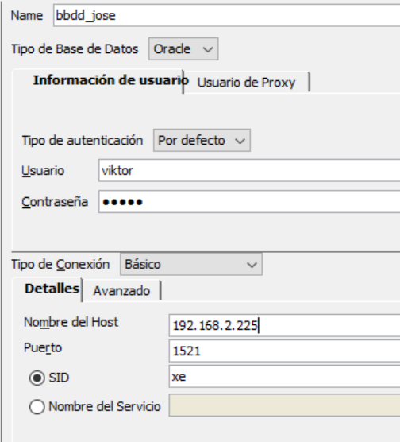
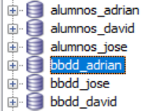
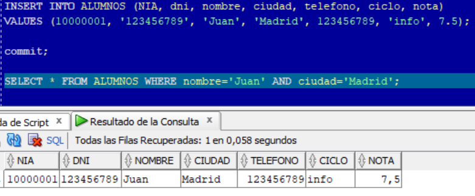
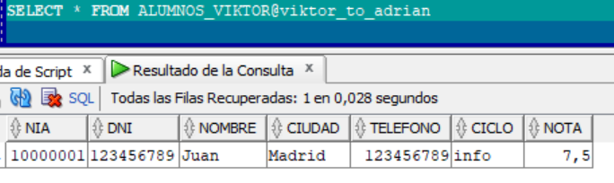
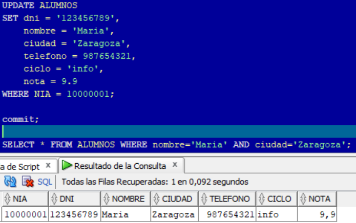
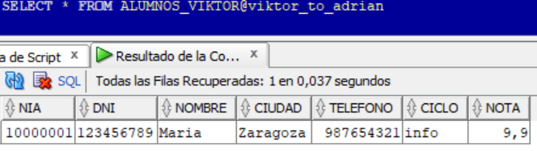
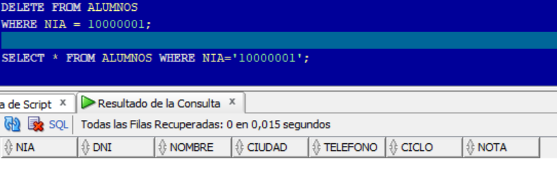

# Administración de Sistemas de Gestión de Bases de Datos

*Victor Martinez Martinez*

Bases de datos distribuidas y replicadas


---

## Paso 1

Creamos lo primero los tablespaces de cada uno de los institutos y de las particiones

El tablespace de Adrian:

```sql
CREATE TABLESPACE ts_ausias
DATAFILE 'C:\app\viktor\product\21c\ausias.dbf' SIZE 100M 
EXTENT MANAGEMENT LOCAL 
SEGMENT SPACE MANAGEMENT AUTO; 
```

El tablespace de David:

```sql
CREATE TABLESPACE ts_jaume 
DATAFILE 'C:\app\viktor\product\21c\jaume.dbf' SIZE 100M 
EXTENT MANAGEMENT LOCAL 
SEGMENT SPACE MANAGEMENT AUTO; 
```

El tablespace de Jose:

```sql
CREATE TABLESPACE ts_enric
DATAFILE 'C:\app\viktor\product\21c\enric.dbf' SIZE 100M 
EXTENT MANAGEMENT LOCAL 
SEGMENT SPACE MANAGEMENT AUTO; 
```

El tablespace de Viktor:

```sql
CREATE TABLESPACE ts_lluis
DATAFILE 'C:\app\viktor\product\21c\lluis.dbf' SIZE 100M 
EXTENT MANAGEMENT LOCAL 
SEGMENT SPACE MANAGEMENT AUTO; 
```

El tablespace de la particion 1:

```sql
CREATE TABLESPACE ts_particion1
DATAFILE 'C:\app\viktor\product\21c\particion1.dbf' SIZE 100M 
EXTENT MANAGEMENT LOCAL 
SEGMENT SPACE MANAGEMENT AUTO; 
```

El tablespace de la particion 2:

```sql
CREATE TABLESPACE ts_particion2
DATAFILE 'C:\app\viktor\product\21c\particion2.dbf' SIZE 100M 
EXTENT MANAGEMENT LOCAL 
SEGMENT SPACE MANAGEMENT AUTO; 
```

El tablespace de la particion 3:

```sql
CREATE TABLESPACE ts_particion3
DATAFILE 'C:\app\viktor\product\21c\particion3.dbf' SIZE 100M 
EXTENT MANAGEMENT LOCAL 
SEGMENT SPACE MANAGEMENT AUTO; 
```

---

## Paso 2

Ahora crearemos todos los usuarios con sus respectibas tablespaces

El usuario de Adrian:

```sql
CREATE USER adrian IDENTIFIED BY 12345 
DEFAULT TABLESPACE ts_ausias
TEMPORARY TABLESPACE TEMP 
QUOTA 70M ON ts_ausias; 
```

El usuario de David:

```sql
CREATE USER david IDENTIFIED BY 12345 
DEFAULT TABLESPACE ts_jaume
TEMPORARY TABLESPACE TEMP 
QUOTA 70M ON ts_jaume; 
```

El usuario de Jose:

```sql
CREATE USER jose IDENTIFIED BY 12345 
DEFAULT TABLESPACE ts_enric
TEMPORARY TABLESPACE TEMP 
QUOTA 70M ON ts_enric; 
```

El usuario de Viktor:

```sql
CREATE USER viktor IDENTIFIED BY 12345 
DEFAULT TABLESPACE ts_lluis
TEMPORARY TABLESPACE TEMP 
QUOTA 70M ON ts_lluis; 
```

## Paso 3

Ahora toca crear las tablas:

La tabla alumnos:

```sql
CREATE TABLE ALUMNOS ( 
    NIA NUMBER(8) PRIMARY KEY, 
    dni VARCHAR2(9) , 
    nombre VARCHAR2(20),  
    ciudad VARCHAR2(15) DEFAULT 'Valencia',  
    telefono NUMBER(9),  
    ciclo VARCHAR2(10),  
    nota NUMBER(2,1) 
)  

PARTITION BY RANGE (NIA) (  
    PARTITION particion_1 VALUES LESS THAN (20000000) TABLESPACE TS_PARTICION1, 
    PARTITION particion_2 VALUES LESS THAN (40000000) TABLESPACE TS_PARTICION2,  
    PARTITION particion_3 VALUES LESS THAN (MAXVALUE) TABLESPACE TS_PARTICION3 
);  
```

## Paso 4

Creamos los db_links para poder conectarnos a las demas bases de datos, la sintaxis sera la siguiente:

Conexion con adrian:

```sql
CREATE DATABASE LINK viktor_to_adrian 
CONNECT TO VIKTOR 
IDENTIFIED BY "12345" 
USING ' 
(DESCRIPTION=(ADDRESS=(PROTOCOL=TCP) 
(HOST=192.168.2.221)(PORT=1521)) 
(CONNECT_DATA=(SERVER=DEDICATED) 
(SERVICE_NAME=XE)))'; 
```

Conexion con jose:

```sql
CREATE DATABASE LINK viktor_to_jose 
CONNECT TO VIKTOR 
IDENTIFIED BY "12345" 
USING ' 
(DESCRIPTION=(ADDRESS=(PROTOCOL=TCP) 
(HOST=192.168.2.225)(PORT=1521)) 
(CONNECT_DATA=(SERVER=DEDICATED) 
(SERVICE_NAME=XE)))'; 
```

Conexion con david:

```sql
CREATE DATABASE LINK viktor_to_david 
CONNECT TO VIKTOR 
IDENTIFIED BY "12345" 
USING ' 
(DESCRIPTION=(ADDRESS=(PROTOCOL=TCP) 
(HOST=192.168.2.223)(PORT=1521)) 
(CONNECT_DATA=(SERVER=DEDICATED) 
(SERVICE_NAME=XE)))'; 
```

Ahora nos conectaremos de manera grafica a la base de datos de cada uno:



Y una vez comprobado esto, creamos una conexion a cada uno de las bases de datos de los demas:



En cada una de las conexiones creamos la tabla de alumnos donde el administrador de cada base de datos nos ha otorgado permisos para crear la tabla, para que los demas puedan hacer lo mismo le otorgaremos tambien permisos de creacion, que, cuando la hayan creado se los revocaremos por seguridad, para ello:

```sql
GRANT CREATE TABLE TO jose; 
GRANT CREATE TABLE TO adrian;
GRANT CREATE TABLE TO david;
```

La base de datos de adrian:

```sql
CREATE TABLE ALUMNOS_VIKTOR ( 

    NIA NUMBER(8) PRIMARY KEY, 
    dni VARCHAR2(9) , 
    nombre VARCHAR2(20),  
    ciudad VARCHAR2(15) DEFAULT 'Valencia',  
    telefono NUMBER(9),  
    ciclo VARCHAR2(10),  
    nota NUMBER(2,1) 
  
)  TABLESPACE TS_VIKTOR;
```

La base de datos de jose:

```sql
CREATE TABLE ALUMNOS_VIKTOR ( 

    NIA NUMBER(8) PRIMARY KEY, 
    dni VARCHAR2(9) , 
    nombre VARCHAR2(20),  
    ciudad VARCHAR2(15) DEFAULT 'Valencia',  
    telefono NUMBER(9),  
    ciclo VARCHAR2(10),  
    nota NUMBER(2,1) 
  
)  TABLESPACE TS_LLUIS;
```

La base de datos de david:

```sql
CREATE TABLE ALUMNOS_VIKTOR ( 

    NIA NUMBER(8) PRIMARY KEY, 
    dni VARCHAR2(9) , 
    nombre VARCHAR2(20),  
    ciudad VARCHAR2(15) DEFAULT 'Valencia',  
    telefono NUMBER(9),  
    ciclo VARCHAR2(10),  
    nota NUMBER(2,1) 
  
)  TABLESPACE TS_VIKTOR;
```

Y despues de que hayan creado las tablas:

```sql
REVOKE CREATE TABLE FROM jose; 
REVOKE CREATE TABLE FROM adrian;
REVOKE CREATE TABLE FROM david;
```

## Paso 5

A continuacion toca dar los permisos necesarios a todos los usuarios

Los permisos de Adrian:

```sql
GRANT CREATE SESSION TO adrian; 
GRANT CONNECT TO adrian; 
GRANT SELECT, DELETE, UPDATE, INSERT ON alumnos_adrian TO adrian;   
```

Los permisos de David:

```sql
GRANT CREATE SESSION TO david; 
GRANT CONNECT TO david; 
GRANT SELECT, DELETE, UPDATE, INSERT ON alumnos_david TO david; 
```

Los permisos de Jose:

```sql
GRANT CREATE SESSION TO jose; 
GRANT CONNECT TO jose; 
GRANT SELECT, DELETE, UPDATE, INSERT ON alumnos_jose TO jose; 
```

Los permisos de Viktor:

```sql
GRANT CREATE SESSION TO viktor; 
GRANT CONNECT TO viktor; 
GRANT CREATE ANY TABLE TO viktor;
GRANT SELECT ANY TABLE TO viktor; 
GRANT DELETE ANY TABLE TO viktor; 
GRANT UPDATE ANY TABLE TO viktor;
GRANT INSERT ANY TABLE TO viktor; 
```

Para que los otros usuarios puedan ver las tablas que han creado hay que ir a la ruta: C:\app\\viktorproduct\21c\homes\OraDB21Home1\network\admin y en el archivo **sqlnet** cambiar en la linea **SQLNET.AUTHENTICATION_SERVICES= (NTS)** por **SQLNET.AUTHENTICATION_SERVICES= (NONE)** y reiniciaremos el servicio o la maquina.

## Paso 6

A continuacion crearemos 3 triggers, uno para las inserciones, otro para las actualizaciones y otro para los borrados:


**Trigger de inserciones:**

```sql
CREATE OR REPLACE TRIGGER INSERCIONES  
AFTER INSERT ON ALUMNOS  
FOR EACH ROW  
BEGIN  
    IF :new.NIA < 20000000 THEN  
       INSERT INTO ALUMNOS_VIKTOR@viktor_to_adrian  
       VALUES (:new.NIA, :new.dni, :new.nombre, :new.ciudad, :new.telefono, :new.ciclo, :new.nota);  
    ELSIF :new.NIA < 40000000 THEN   
        INSERT INTO ALUMNOS_VIKTOR@viktor_to_david  
        VALUES (:new.NIA, :new.dni, :new.nombre, :new.ciudad, :new.telefono, :new.ciclo, :new.nota);  
    ELSE   
        INSERT INTO ALUMNOS_VIKTOR@viktor_to_jose 
        VALUES (:new.NIA, :new.dni, :new.nombre, :new.ciudad, :new.telefono, :new.ciclo, :new.nota);  
    END IF;  
END; 
COMMIT;
```

Ahora para comprobar que funciona, insertaremos un alumno en mi tabla y el trigger deberia encargase de crear el alumno tambien en la base de datos de adrian:

**Tabla de mi base de datos:**



**Tabla de la base de datos de adrian:**



**Trigger de actualizaciones:**

```sql
CREATE OR REPLACE TRIGGER ACTUALIZACIONES  
AFTER UPDATE ON ALUMNOS  
FOR EACH ROW  
BEGIN  
    IF :new.NIA < 20000000 THEN  
       UPDATE ALUMNOS_VIKTOR@viktor_to_adrian SET  
       NIA = :new.NIA,  
       dni = :new.dni,  
       nombre = :new.nombre,  
       ciudad = :new.ciudad,  
       telefono = :new.telefono,  
       ciclo = :new.ciclo, 
       nota = :new.nota  
       WHERE NIA = :new.NIA;  
   ELSIF :new.NIA < 40000000 THEN   
    UPDATE ALUMNOS_VIKTOR@viktor_to_david SET  
       NIA = :new.NIA,  
       dni = :new.dni,  
       nombre = :new.nombre,  
       ciudad = :new.ciudad,  
       telefono = :new.telefono,  
       ciclo = :new.ciclo, 
       nota = :new.nota  
       WHERE NIA = :new.NIA;  
    ELSE  
        UPDATE ALUMNOS_VIKTOR@viktor_to_jose SET  
       NIA = :new.NIA,  
       dni = :new.dni,  
       nombre = :new.nombre,  
       ciudad = :new.ciudad,  
       telefono = :new.telefono,  
       ciclo = :new.ciclo,  
       nota = :new.nota  
       WHERE NIA = :new.NIA;  
    END IF; 
   NULL;  
END; 
COMMIT;
```

Ahora para comprobar que funciona, modificaremos un alumno en mi tabla y el trigger deberia encargase de modificar el alumno tambien en la base de datos de adrian:

**Tabla de mi base de datos:**



**Tabla de la base de datos de adrian:**



**Trigger de borrados:**

```sql
CREATE OR REPLACE TRIGGER borrados
AFTER DELETE ON ALUMNOS  
FOR EACH ROW  
BEGIN  
    IF :old.NIA < 20000000 THEN  
        DELETE ALUMNOS_VIKTOR@viktor_to_adrian WHERE NIA=:old.NIA;  
    ELSIF :old.NIA < 40000000 THEN  
            DELETE ALUMNOS_VIKTOR@viktor_to_david WHERE NIA=:old.NIA;  
    ELSE  
            DELETE ALUMNOS_VIKTOR@viktor_to_jose WHERE NIA=:old.NIA;  
    END IF; 
NULL;  
END;  
COMMIT;

```

Ahora para comprobar que funciona, borraremos un alumno en mi tabla y el trigger deberia encargase de borrar el alumno tambien en la base de datos de adrian:

**Tabla de mi base de datos:**



**Tabla de la base de datos de adrian:**

