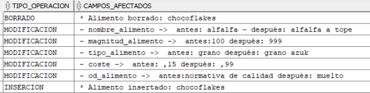
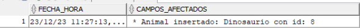
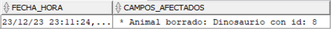
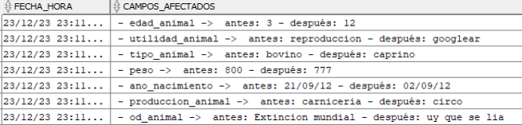
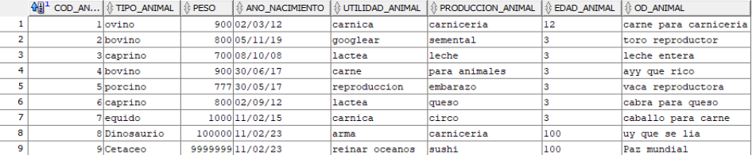
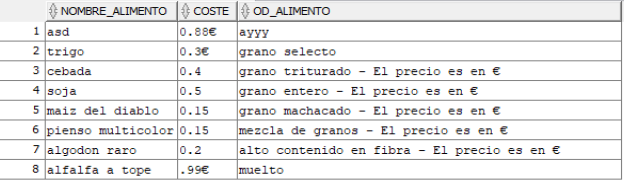

# PR4-1 Disparadores sobre Dieta Ganadera
*Victor Martinez Martinez*

---

## Trigger 1

Crea un disparador que controle las inserciones, actualizaciones y borrados de la tabla alimento, insertando en la tabla t_log_alimento, un registro que muestre la operación realizada en un campo tipo_operacion y en otro campo nos muestre los campos sobre los que se han realizado las operaciones, de manera que si es una actualización, muestre solo los campos modificados. Realiza una prueba de cada una de ellas, escribe el código del disparador, de las pruebas y capturas que demuestren que funciona correctamente.

```bash

CREATE OR REPLACE TRIGGER CONTROL
AFTER DELETE OR INSERT OR UPDATE ON alimento
FOR EACH ROW
  DECLARE
      vtipo_operacion VARCHAR2(100);
      vcampos_afectados VARCHAR2(1000);
  
  BEGIN 
    IF INSERTING THEN
      vtipo_operacion := 'INSERCION';
      vcampos_afectados := ' * Alimento insertado: '||:new.nombre_alimento;
    END IF;

    IF UPDATING THEN
      vtipo_operacion := 'MODIFICACION';
      vcampos_afectados := '';
    
    IF UPDATING('nombre_alimento') THEN
      vcampos_afectados := vcampos_afectados || ' - nombre_alimento ->  antes: ' ||:old.nombre_alimento  ||' - después: ' ||:new.nombre_alimento; 
    END IF;
    
    IF UPDATING('tipo_alimento') THEN
      vcampos_afectados := vcampos_afectados || ' - tipo_alimento ->  antes: ' ||:old.tipo_alimento  ||' después: ' ||:new.tipo_alimento; 
    END IF;
    
    IF UPDATING('coste') THEN
      vcampos_afectados := vcampos_afectados || ' - coste ->  antes: ' ||:old.coste  ||' después: ' ||:new.coste; 
    END IF;
    
    IF UPDATING('od_alimento') THEN
      vcampos_afectados := vcampos_afectados || ' - od_alimento ->  antes:' ||:old.od_alimento||' después: ' ||:new.od_alimento; 
    END IF;
    
    IF UPDATING('magnitud_alimento') THEN
      vcampos_afectados := vcampos_afectados || ' - magnitud_alimento ->  antes:' ||:old.magnitud_alimento||' después: ' ||:new.magnitud_alimento; 
    END IF;
    
    END IF;
    
    IF DELETING THEN
      vtipo_operacion := 'BORRADO';
      vcampos_afectados := ' * Alimento borrado: ' ||:old.nombre_alimento;
    END IF;
    
    INSERT INTO t_log_alimento (tipo_operacion, campos_afectados)
    VALUES (vtipo_operacion, vcampos_afectados);
  END;
```

### Comprobacion

Para comprobar que el trigger funciona de manera correcta, he insertado un nuevo alimento, chocoflakes, despues lo he borrado y para comprobar las modificaciones he ido cambiando los valores de distintos alimentos, despues de haber hecho todas las pruebas el resultado de la tabla t_log_alimento es la siguiente:



Aqui las sentencias de las pruebas:

```bash
INSERT INTO alimento(NOMBRE_ALIMENTO, TIPO_ALIMENTO, MAGNITUD_ALIMENTO, COSTE, OD_ALIMENTO)
VALUES ('chocoflakes','prueba','0.99','100','prueba');

DELETE FROM alimento
WHERE NOMBRE_ALIMENTO = 'chocoflakes';

UPDATE alimento
SET  NOMBRE_ALIMENTO = 'alfalfa a tope'
WHERE NOMBRE_ALIMENTO = 'alfalfa' ;

UPDATE alimento
SET  MAGNITUD_ALIMENTO = '999'
WHERE NOMBRE_ALIMENTO = 'cebada';

UPDATE alimento
SET  TIPO_ALIMENTO = 'grano azuk'
WHERE NOMBRE_ALIMENTO = 'trigo';

UPDATE alimento
SET  COSTE = '0,99'
WHERE NOMBRE_ALIMENTO = 'algodon';

UPDATE alimento
SET  OD_ALIMENTO = 'muelto'
WHERE NOMBRE_ALIMENTO = 'alfalfa';
```

---

## Trigger 2

Crea un disparador que controle las inserciones, actualizaciones y borrados de la tabla animal, insertando en la tabla t_log_actualiz_animal cuando se realice una inserción, en la tabla t_log_borrado_animal cuando se realice un borrado y en la tabla t_log_inserc_animal cuando se realice una inserción. Los registros en las tres tablas contendrán la fecha y hora en la que se realiza la operación y en otro campo los campos sobre los que se opera. En el caso de la modificación, se mostrarán solo los campos que se modifican.

```bash
CREATE OR REPLACE TRIGGER CONTROL_ANIMAL
AFTER DELETE OR INSERT OR UPDATE ON animal
FOR EACH ROW
  DECLARE

    vcampos_afectados VARCHAR2(1000);
        
  BEGIN 
    IF INSERTING THEN
      vcampos_afectados := ' * Animal insertado: '||:new.tipo_animal || ' con id: ' ||:new.cod_animal;
            
      INSERT INTO t_log_inserc_animal (fecha_hora, campos_afectados)
        VALUES (to_char(SYSDATE,'DD/MM/YYYY hh24:mi'),vcampos_afectados);
    END IF;
        
    IF UPDATING THEN
      vcampos_afectados := '';
            
      IF UPDATING('tipo_animal') THEN
        vcampos_afectados := vcampos_afectados || ' - tipo_animal ->  antes: ' ||:old.tipo_animal  ||' - después: ' ||:new.tipo_animal; 

        INSERT INTO t_log_inserc_animal (fecha_hora, campos_afectados)
          VALUES (to_char(SYSDATE,'DD/MM/YYYY hh24:mi'),vcampos_afectados);
      END IF;
              
      IF UPDATING('peso') THEN
        vcampos_afectados := vcampos_afectados || ' - peso ->  antes: ' ||:old.peso  ||' - después: ' ||:new.peso; 

        INSERT INTO t_log_inserc_animal (fecha_hora, campos_afectados)
          VALUES (to_char(SYSDATE,'DD/MM/YYYY hh24:mi'),vcampos_afectados);
      END IF;   

      IF UPDATING('ano_nacimiento') THEN
        vcampos_afectados := vcampos_afectados || ' - ano_nacimiento ->  antes: ' ||:old.ano_nacimiento  ||' - después: ' ||:new.ano_nacimiento; 

        INSERT INTO t_log_inserc_animal (fecha_hora, campos_afectados)
          VALUES (to_char(SYSDATE,'DD/MM/YYYY hh24:mi'),vcampos_afectados);
      END IF;

      IF UPDATING('utilidad_animal') THEN
        vcampos_afectados := vcampos_afectados || ' - utilidad_animal ->  antes: ' ||:old.utilidad_animal  ||' - después: ' ||:new.utilidad_animal; 

        INSERT INTO t_log_inserc_animal (fecha_hora, campos_afectados)
          VALUES (to_char(SYSDATE,'DD/MM/YYYY hh24:mi'),vcampos_afectados);
      END IF;

      IF UPDATING('produccion_animal') THEN
        vcampos_afectados := vcampos_afectados || ' - produccion_animal ->  antes: ' ||:old.produccion_animal  ||' - después: ' ||:new.produccion_animal; 

        INSERT INTO t_log_inserc_animal (fecha_hora, campos_afectados)
          VALUES (to_char(SYSDATE,'DD/MM/YYYY hh24:mi'),vcampos_afectados);
      END IF;

      IF UPDATING('edad_animal') THEN
        vcampos_afectados := vcampos_afectados || ' - edad_animal ->  antes: ' ||:old.edad_animal  ||' - después: ' ||:new.edad_animal; 

        INSERT INTO t_log_inserc_animal (fecha_hora, campos_afectados)
          VALUES (to_char(SYSDATE,'DD/MM/YYYY hh24:mi'),vcampos_afectados);
      END IF;

      IF UPDATING('od_animal') THEN
        vcampos_afectados := vcampos_afectados || ' - od_animal ->  antes: ' ||:old.od_animal  ||' - después: ' ||:new.od_animal; 

        INSERT INTO t_log_inserc_animal (fecha_hora, campos_afectados)
          VALUES (to_char(SYSDATE,'DD/MM/YYYY hh24:mi'),vcampos_afectados);
      END IF;

    END IF;

    IF DELETING THEN
      vcampos_afectados := ' * Animal borrado: '||:old.tipo_animal || ' con id: ' ||:old.cod_animal;
            
      INSERT INTO t_log_borrado_animal (fecha_hora, campos_afectados)
        VALUES (to_char(SYSDATE,'DD/MM/YYYY hh24:mi'),vcampos_afectados);
    END IF;

END;
```

### Comprobacion

Para comprobar que el trigger funciona de manera correcta, he insertado un nuevo animal, de tipo dinosaurio: 
```bash
INSERT INTO animal(cod_animal, tipo_animal, peso, ano_nacimiento, utilidad_animal, produccion_animal, od_animal, edad_animal)
VALUES (8, 'Dinosaurio', 100000, TO_DATE('11-02-1923', 'DD-MM-YYYY'), 'arma', 'carniceria', 'Extincion mundial', 100);
```



Despues lo he borrado y esa accion se ve reflejada en la tabla t_log_borrado_animal:
```bash
DELETE FROM animal
WHERE cod_animal = '8';
```



Y para comprobar las modificaciones he ido cambiando los valores de distintos animales, despues de haber hecho todas las pruebas el resultado de la tabla t_log_actualiz_animal es la siguiente:

```bash
UPDATE ANIMAL 
SET EDAD_ANIMAL = '12' 
WHERE cod_animal = '1'

UPDATE ANIMAL 
SET UTILIDAD_ANIMAL = 'googlear' 
WHERE cod_animal = '2'

UPDATE ANIMAL 
SET TIPO_ANIMAL = 'caprino' 
WHERE cod_animal = '3'

UPDATE ANIMAL 
SET PESO = '777' 
WHERE  = 'cod_animal' = '5'

UPDATE ANIMAL 
SET ANO_NACIMIENTO = TO_DATE('2012-09-02 00:00:00', 'YYYY-MM-DD hh24:mi:ss') 
WHERE cod_animal = '6'

UPDATE ANIMAL 
SET PRODUCCION_ANIMAL = 'circo' 
WHERE cod_animal = '7'

UPDATE ANIMAL 
SET OD_ANIMAL = 'uy que se lia' 
WHERE cod_animal = '8' 

```



---

## Trigger 3

Crea una vista t_v_animal sobre la tabla animal. Crea un disparador que controle que en caso de que se inserte un registro con un peso negativo, en su lugar inserte el valor 0 en el campo Realiza pruebas insertando registros correctos e incorrectos, sobre la vista.

Lo primero para crear la vista se hace de la siguiente manera: 

```bash
CREATE VIEW t_v_animal AS
SELECT cod_animal, tipo_animal, peso
FROM animal;
```

El trigger seria el siguiente:

```bash
CREATE OR REPLACE TRIGGER tr_before_insert_animal
INSTEAD OF INSERT ON t_v_animal
FOR EACH ROW
DECLARE 
  vpeso animal.peso%TYPE;
BEGIN
    
  IF :new.peso < 0 THEN
    vpeso := 0;
  ELSE
    vpeso := :new.peso;       
  END IF;
  INSERT INTO animal(cod_animal, tipo_animal, peso, ano_nacimiento, utilidad_animal, produccion_animal, od_animal, edad_animal )
    VALUES (:new.cod_animal, :new.tipo_animal, vpeso, :new.ano_nacimiento, :new.utilidad_animal, :new.produccion_animal, :new.od_animal, :new.edad_animal);

END;
```

Para comprobar que funciona correctamente, vamos a insertar primero un animal que este bien:

```bash
INSERT INTO animal(cod_animal, tipo_animal, peso, ano_nacimiento, utilidad_animal, produccion_animal, od_animal, edad_animal)
VALUES (9, 'Cetaceo', 9999999, TO_DATE('11-02-1923', 'DD-MM-YYYY'), 'reinar oceanos', 'sushi', 'Paz mundial', 100);
```
Y podemos ver que se ha insertado correctamente:



Y aqui para insertarlo mal

```bash
INSERT INTO animal(cod_animal, tipo_animal, peso, ano_nacimiento, utilidad_animal, produccion_animal, od_animal, edad_animal)
VALUES (10, 'Cetaceo', -9999999, TO_DATE('11-02-1923', 'DD-MM-YYYY'), 'reinar oceanos', 'sushi', 'Paz mundial', 100);
```


---

## Trigger 4

Crea una vista t_v_alimento sobre la tabla alimento. De manera que cuando si inserte un registro en la vista, se escriba en el campo od_alimento el texto “El precio es en €”. Si se ha insertado algo en este campo, se añada el texto al final. Y si el texto del campo od_alimento ya contiene la letra “€”, no debe añadir el texto. Se debe controlar también que cuando se realiza una modificación, si el campo od_alimento no tiene ese texto, lo inserte.

La manera en la que crearemos la vista sera la siguiente:

```bash
CREATE OR REPLACE VIEW t_v_alimento AS
SELECT
    nombre_alimento,
    coste,
    CASE
        WHEN coste NOT LIKE '%€' THEN 'El precio es en €'
        ELSE
          od_alimento
    END AS od_alimento
FROM alimento;
```
Y si observamos la vista:





