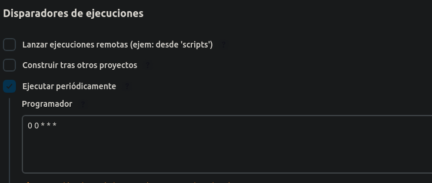

# Tarea 1
*Victor Martinez Martinez*

Job basico
---

## Paso 1
**Lo primero crearemos un nuevo job en jenkins: Panel de control -> Nueva Tarea -> Crea un proyecto de estilo libre y le indicaremos un nombre, si hemos seguidoo bien todos los pasos no saldra lo siguiente:**  


## Paso 2
**Ahora para que el job se ejecute una vez al dia habra que ir hasta el apartado de disparadores de ejecucion y marcar la casilla de ejecutar periodicamente, no saldra un recuadro donde tendremos que rellenarlo asi:**


Asi el trabajo se ejecutara todos los dias a las 00:00 todos los dias

## Paso 3
**Ahora le tenemos que indicar que tiene que hacer cada vez que llegue esa hora, en este caso ejecutara un script que compruebe que no hay ningun usuario con id mas grande que 1005, si lo hay que se ejecute de manera erronea para que haya un aviso:**
Aqui esta el codigo:

```bash
#!/bin/bash

file=(/etc/passwd)
while read line ; do

  id=$(echo $line | cut -d ":" -f3) 
  if [ $id -gt 1005 -a $id -lt 5000 ]; then
    exit 1	 
  fi

done < "$file"
```

Y lo insertaremos en el siguiente cuadro:


En este apartado tendremos que indicar la opcion de ejecutar un comando de shell

## Paso 4
**Para informar al administrador en caso de que el script de error, el job tendra que enviar un mensaje por telegram, para ello en el apartado de Acciones para ejecutar despues -> Add a build step -> ejecutar linea de comandos Shell y pegaremos el siguiente comado:**
```bash
curl -X POST -H "Content-Type: application/json" -d "{\"chat_id\": \"TU_ID\", \"text\": \"Falló la tarea $JOB_NAME!! $BUILD_NUMBER,  \", \"disable_notification\": false}" TU_API
```
Tambien le tendremos que indicar que haga esto si el resultado del script ha acabado con un error 


Despues de esto guardaremos j0b y ya estara hecha la parte de jenkins

## Paso 5
**Crearemos el bot de telegram y una vez ejecutado el job, en caso de que haya un usuario con id mas grande de 1005 nos enviara el siguiente mensaje:**


