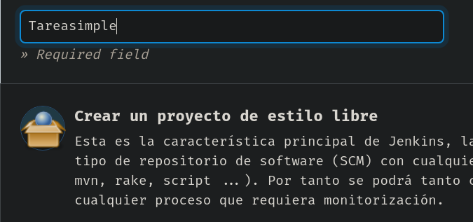
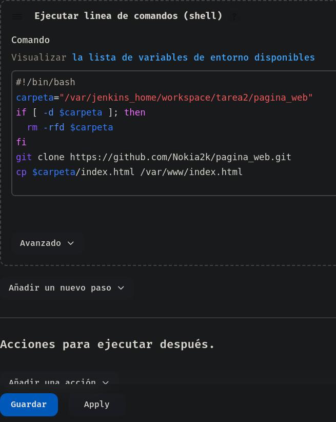
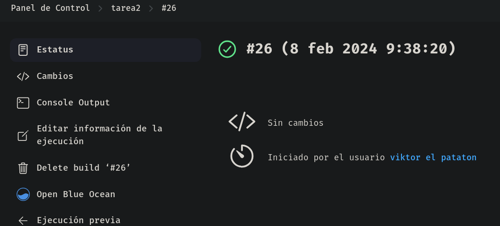
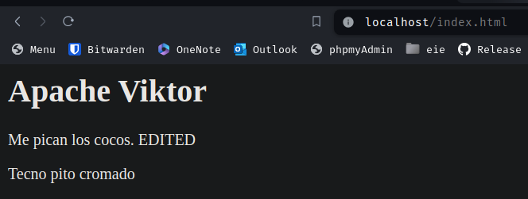

# Jenkins con Pipelines
*Victor Martinez Martinez*

Comunicacion entre contenedores (Con Jenkins y pila LAMP)
---

## Paso previo

**Vamos a necesitar crear un volumen que comparta una carpeta entre en el contenedor de jenkins y el servidor web, para ello ejecutaremos este comando de docker:**

```bash
docker run --name jenkins -p 9999:8080 -p 50000:50000 -v /home/viktor/docker-lamp/www:/var/www -v /home/viktor/jenkins:/var/jenkins_home jenkins:latest
```
De esta manera en el contenedor de jenkins tendra la carpeta **/var/www** compartida con el contenedor de la pila LAMP que cuando lo montamos con dockerfile ya monta ese volumen en esa carpeta local

## Paso 1
**Primeramente crearemos un nuevo job de jenkins:** 
 


## Paso 2
**Cuando vayamos a configurarlo, le damos una pequeña descripcion para orientarnos mejor y vamos a la seccion de Build Steps y indicamos lo siguiente:**
Ejecutar linea de comandos (shell) y el siguiente script:
```bash
#!/bin/bash
carpeta="/var/jenkins_home/workspace/tarea2/pagina_web"
if [ -d $carpeta ]; then
  rm -rfd $carpeta
fi

git clone https://github.com/Nokia2k/pagina_web.git
cp $carpeta/index.html /var/www/index.html
```
Aplicamos el cambio y guardaremos




**En github creamos el repositorio con un README y un archivo simple de html con el siguiente contenido**

```bash
<html>
  <head>
    <title>Pagina web jenkins tarea 2</title>
  </head>
  <body>
    <h1>Apache Viktor</h1>
    <p>
      Me pican los cocos
    </p>
    <p>
      Turbo psicosis esclerotica
    </p>
  </body>
</html>
```


## Paso 3

**Ahora si construimos la tarea podemos observar que ha ido haciendo paso por paso lo que le hemos ido indicando:**



Y si vamos a ver el apache del contenedor que comparte el volumen con jenkins vemos lo siguiente:




