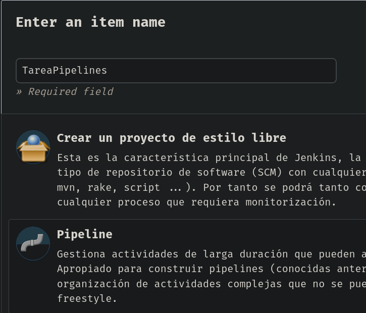
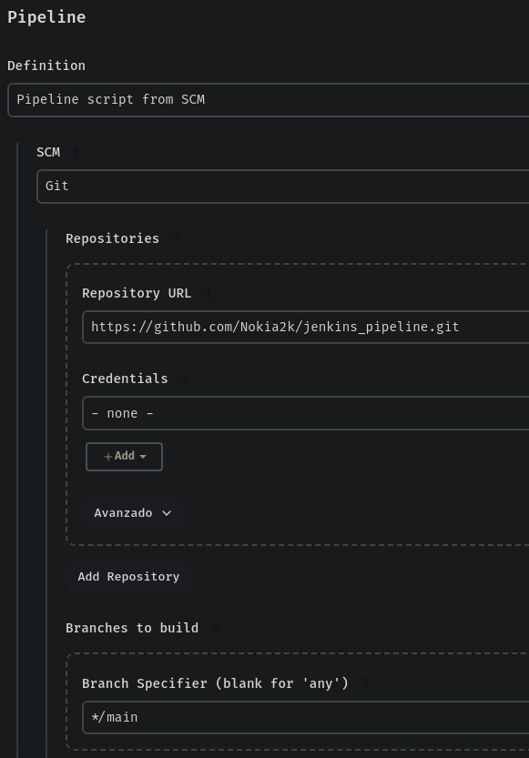
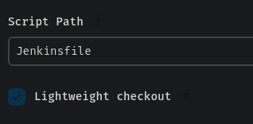
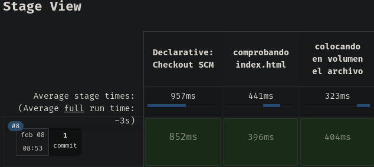
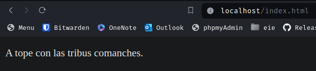

# Jenkins con Pipelines
*Victor Martinez Martinez*

Comunicacion entre contenedores con pipeles (Con Jenkins y pila LAMP)
---

## Paso 1
**Primeramente crearemos un nuevo job de jenkins:** 
 


## Paso 2
**Cuando vayamos a configurarlo, le damos una pequeña descripcion para orientarnos mejor y vamos a la seccion de pipeline y indicamos lo siguiente::**
Le pondremos:
- Pipeline script from SCM
- Git
- La url del .git donde tengamos el area de trabajo
- Especificaremos la rama raiz, en mi caso main
- Le indicaremos tambien el nombre del jenkinsfile, en mi caso Jenkinsfile




Como anteriormente ya habiamos creado un volumen que comunicase el contenedor de jenkins con el docker con el servidor web no requerimos de volver a hacerlo ya que estamos usando los mismos contenedores

**En github creamos el repositorio con un archivo simple de html, un README y el jenkinsfile con el siguiente contenido**
```bash
pipeline {
  agent any
  stages {
    stage('comprobando index.html') {
      steps {
        sh '''#!/bin/bash
        index=/var/www/index.html
	    ws=/var/jenkins_home/workspace/Tarea3
	    if [ -e $index ]; then rm -rf $index; fi'''
      }
    }
    stage('colocando en volumen el archivo') {
      steps {
        sh 'cp /var/jenkins_home/workspace/Tarea3/index.html /var/www/index.html'
      }
    }

  }
}
```

y el archivo simple de html tiene el siguiente contenido:

```bash
<!doctype html>
<html>
  <head>
    <title>Jenkins con pipelines</title>
  </head>
  <body>
    <p>A tope con las tribus comanches.</p>
  </body>
</html>
```


## Paso 3

**Ahora si construimos la tarea podemos observar que ha ido haciendo paso por paso lo que le hemos ido indicando:**



Y si vamos a ver el apache del contenedor que comparte el volumen con jenkins vemos lo siguiente:




