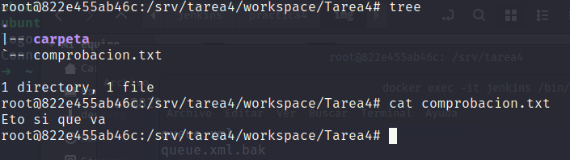

# Jenkins con Pipelines
*Victor Martinez Martinez*

Comunicacion entre ndos (Con Jenkins y java y ssh)
---

Paso previo:
Ir a panel de control -> administrar y cambiar la ip por la de la maquina

## Paso 1
En un docker que este en la misma red que la maquina con jenkins descargamos un paquete de java:

```bash
sudo apt install default-jre
```

Tambien descargaremos el paquete curl para usarlo mas tarde

```bash
sudo apt install curl
```

Creamos unas credenciales para el nodo que crearemos despues


Y ahora creamos el nodo de java


creamos un directorio en srv llamado tarea4 donde se va a crear todo el workspace con las tareas que se hagan en ese nodo

```bash
sudo mkdir /srv/tarea4
```
Ahora en el contenedor ejecutamsos los comandos que nos indica el nodo para conectarnos con el jenkins:

```bash
curl -sO http://172.17.0.1:9999/jnlpJars/agent.jar
java -jar agent.jar -jnlpUrl http://172.17.0.1:9999/computer/nodo1%5Fjava/jenkins-agent.jnlp -secret ea6c79817641b10269e54bf74c11bd4a1c3fc7bb7b4ceebd51954a8931c25d85 -workDir "/srv/tarea4"
```


Si creamos una tarea sencillita y indicamos: "Restringir dónde se puede ejecutar este proyecto: colocar el nombre del nodo". La ejecutamos podemos ver lo siguiente:


Y dentro de la maquina:




## Paso 2

Lo primero que habra que hacer es crear una instancia nueva en aws, despues de haber entrado en ella, nos descargamos el mismo paquete que en la otra maquina:

```bash
sudo apt install default-jre
```

Ahora tambien toca crear las credenciales


Y la creacion del nodo:


Y con la misma tarea pero indicandole que la ejecutemos en la nueva maquina vemos lo siguiente:


y si vamos a la maquina y vemos su contenido vemos que si que ha hecho lo que pediamos:


