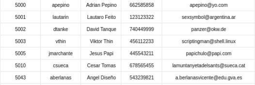

# Tarea Final

*Victor Martinez Martinez*

## Automatizando Tareas con docker

### Paso 1

Lo primero sera crear el repositorio donde se subiran los xlsx de los empleados antiguos y nuevos junto con el script de python que compruebe linea por linea todas las modificaciones que ha habido:


### Paso 2

Ahora crearemos un contenedor de jenkins donde crearemos la tarea que ejecutara el nodo, para ello:

```
docker run --name jenkins -p 8080:8080 -p 50000:50000
```

Una vez se haya hecho toda la instalacion y ya consigamos entrar en el panel de control pasaremos a crear el nodo que ejecute el script de python, genere el meta-script y los markdown y pdf necesarios.

Para crear el nodo utilizaremos una imagen de ubuntu y instalaremos varios paquetes que necesitaremos, para ello haremos lo siguiente:

```
docker pull ubuntu
docker run -it --name=nodo_jenkins ubuntu:latest /bin/bash
```

Dentro del contenedor haremos un update y instalaremos los siguientes paquetes:

* python
* git
* default-jre
* pandoc
* wkhtmltopdf
* pip

con pip instalaremos el paquete openpyxl

### Paso 3

En el contenedor de jenkins cambiaremos unos parametros para un correcto funcionamiento.

Lo primero que haremos sera ir a **Panel de control -> Administrar Jenkins -> System**  y dentro de este menu buscamos la directiva **Direccion web de Jenkins**  y ponemos la ip de la maquina en mi caso **172.17.0.2**:


### Paso 4

Ahora nos toca crear el nodo que se comunicara con el contenedor de jenkins, para ello iremos a **Panel de control -> Administrar Jenkins -> Nodes** en este menu crearemos un nodo:


Y lo configuraremos de la sigiuente manera:


### Paso 5

Ahora, cuando este nodo reciba y ejecute el script de python creara un script de bash que enviara al servidor final, lo primero sera crear ese servidor.
Usaremos otro contenedor, para ello ejecutaremos este comando:

```
docker run -it --name=servidor ubuntu:latest /bin/bash
```

En este servidor lo primero que tendremos que hacer sera crear todos los usurios que se hayen en el antiguo xlsx para comparar con el nuevo xlsx.
Los usuarios que hay que crear son los siguientes:



ACORDARSE DE INICIAR EL .JAR EN /SRV PARA EL TEMA DEL NODO
