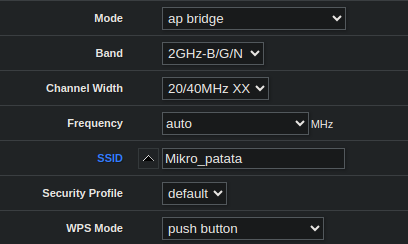
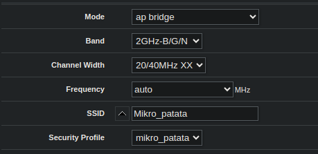
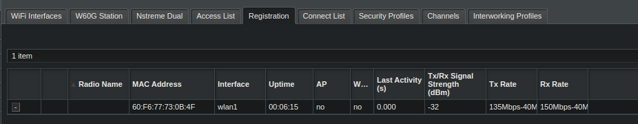

# Reto4
*Victor Martinez Martinez*

Seguridad en redes inalambricas ( Mikrotik )
---

## Paso 1
**Lo primero que hay que haceres cambiar el SSID de la red wifi:**
Para ello entraremos en el apartado **Wireless** en la interfaz de wlan1:

## Paso 2

**Para darle una contraseña, añadiremos un grupo de seguridad:**

Despues de esto añadiremos el grupo al SSID:

## Paso 3

**A continuacion filtraremos las MACS, para ello con un equipo dentro de la red entraremos en registration:**

## Paso 4

**Entramos en la configuracion de ese equipo y le clicamos a copy to Access list y Connect List:**

