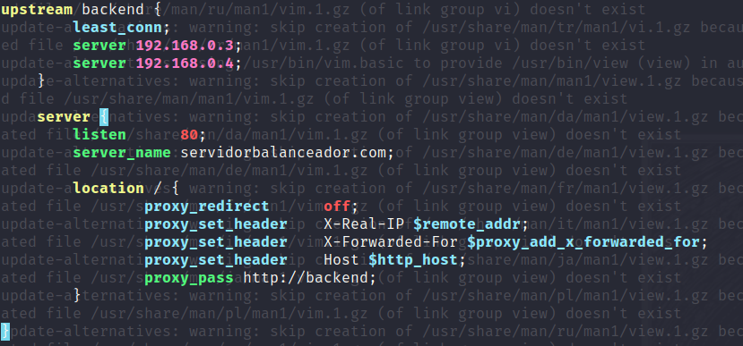
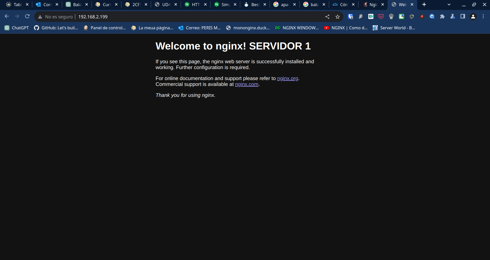

# Reto4
*Victor Martinez Martinez*

Balanceador de carga (Con servidores nginx y un mikrotik)
---

## Paso 1
**Creamos la estructura dentro de gns3:**  


Hay que tener en cuenta que los servidores tienes las siguientes ip:
**Nginx_balanceador:** 192.168.0.2
**Nginx_servidor1:** 192.168.0.3
**Nginx_servidor2:** 192.168.0.4
La red ya esta configurada para que el router de mikrotik haga un forwarding a la red externa y los servidores puedan salir de la red tambien 


## Paso 2

**En el servidor de balanceo añadiremos la siguiente configuracion en el .conf:**
```bash
upstream backend {
	least_conn;
        server 192.168.0.3;
        server 192.168.0.4;
    }
    server {
        listen      80;
        server_name servidorbalanceador.com;
        location / {
	        proxy_redirect      off;
	        proxy_set_header    X-Real-IP $remote_addr;
	        proxy_set_header    X-Forwarded-For $proxy_add_x_forwarded_for;
	        proxy_set_header    Host $http_host;
		proxy_pass http://backend;
	}
}
```

La salida sera algo como esto:


Y ejecutaremos **nginx -t** para comprobar si la configuracion es correcta:

## Paso 3

**Ahora reiniciaremos el gns3 para que se reinicien todos los servicios:**

## Paso 4

**En el navegador comprobaremos que nos envia a un servidor de nginx primeramente:**



Ahora recargaremos la pagina varias veces hasta ver que cambia de pagina, de esta manera nos daremos cuenta que los servidores van balanceando la carga:


## Paso 5
**Si quisieramos usar otro metodo de balanceo a hash simplemente cambiaremos la segunda linea del archivo:**
```bash
upstream backend {
	ip_hash;
        server 192.168.0.3;
        server 192.168.0.4;
    }
    server {
        listen      80;
        server_name servidorbalanceador.com;
        location / {
	        proxy_redirect      off;
	        proxy_set_header    X-Real-IP $remote_addr;
	        proxy_set_header    X-Forwarded-For $proxy_add_x_forwarded_for;
	        proxy_set_header    Host $http_host;
		proxy_pass http://backend;
	}
}
```
