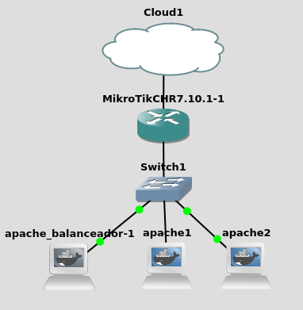
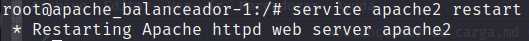
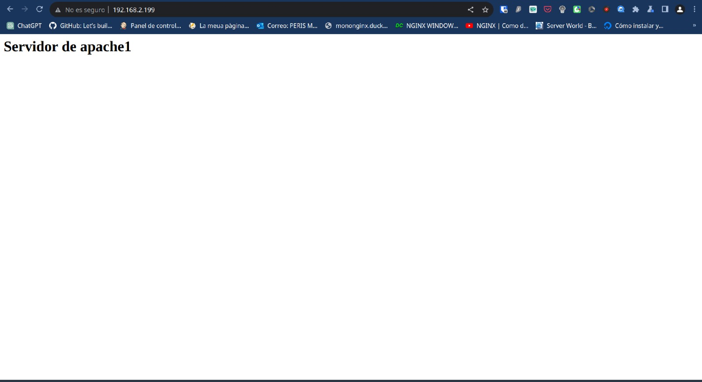

# Reto4
*Victor Martinez Martinez*

Balanceador de carga (Con servidores apache y un mikrotik)
---

## Paso 1
**Creamos la estructura dentro de gns3:**  


Hay que tener en cuenta que los servidores tienes las siguientes ip:
- **Apache_balanceador:** 192.168.0.2
- **Apache_servidor1:** 192.168.0.3
- **Apache_servidor2:** 192.168.0.4
La red ya esta configurada para que el router de mikrotik haga un forwarding a la red externa y los servidores puedan salir de la red tambien 


## Paso 2

**En el servidor de balanceo añadiremos la siguiente configuracion en el 000-default.conf:**
```bash
<VirtualHost *:80>
    ServerAdmin webmaster@localhost
    DocumentRoot /var/www/html

    ProxyPass /balancer-manager !

    <Proxy "balancer://mycluster">
        BalancerMember http://192.168.0.3:80
        BalancerMember http://192.168.0.4:80
        ProxySet lbmethod=byrequests
    </Proxy>

    ProxyPass /balancer-manager !
    ProxyPass / balancer://mycluster/
    ProxyPassReverse / balancer://mycluster/

    <Directory "/var/www/html">
        Options Indexes FollowSymLinks
        AllowOverride None
        Require all granted
    </Directory>

    ErrorLog ${APACHE_LOG_DIR}/error.log
    CustomLog ${APACHE_LOG_DIR}/access.log combined
</VirtualHost>

```

A continuacion reiniciaremos el servicio apache con **service apache2 restart**:

## Paso 3

**Ahora reiniciaremos el gns3 para que se reinicien todos los servicios**

## Paso 4

**En el navegador comprobaremos que nos envia a un servidor de apache primeramente:**



Ahora recargaremos la pagina varias veces hasta ver que cambia de pagina, de esta manera nos daremos cuenta que los servidores van balanceando la carga:


## Paso 5
**Si quisieramos usar otro metodo de balanceo a requests simplemente cambiaremos el archivo por el siguiente:**
```bash
<VirtualHost *:80>
    ServerAdmin webmaster@localhost
    DocumentRoot /var/www/html

    <Proxy "balancer://mycluster">
        BalancerMember http://192.168.0.3:80
        BalancerMember http://192.168.0.4:80
        ProxySet lbmethod=bybusyness
    </Proxy>

    ProxyPass /balancer-manager !

    ProxyPass / balancer://mycluster/
    ProxyPassReverse / balancer://mycluster/

    <Directory "/var/www/html">
        Options Indexes FollowSymLinks
        AllowOverride None
        Require all granted
    </Directory>

    ErrorLog ${APACHE_LOG_DIR}/error.log
    CustomLog ${APACHE_LOG_DIR}/access.log combined
</VirtualHost>
```
