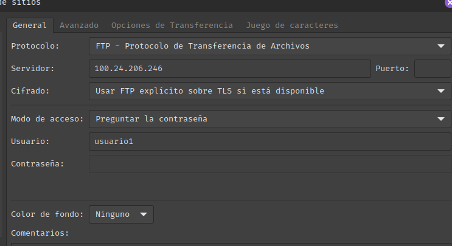
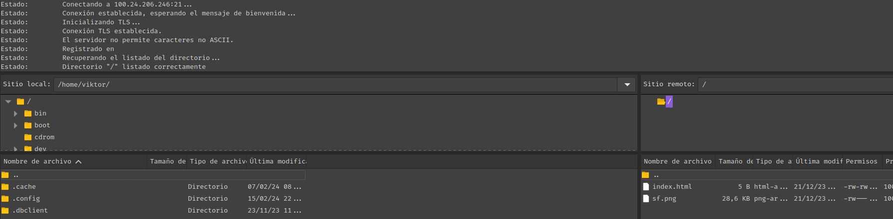
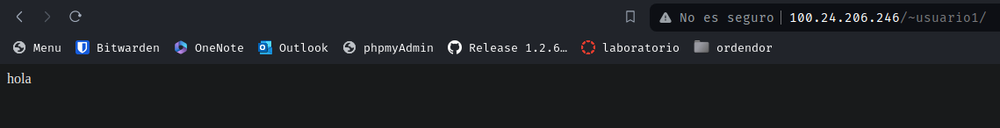

# Reto2

*Victor Martinez Martinez*

VSFTPD
------

## Paso 1

**Lo primero instalaremos el servicio:**

```bash
sudo apt install vsftpd
```

## Parte 2

**En /etc/vsftpd.conf las lineas que usaremos seran las siguientes:**

```bash
listen=YES
listen_ipv6=NO
anonymous_enable=NO
local_enable=YES
write_enable=YES
dirmessage_enable=YES
use_localtime=YES
xferlog_enable=YES
ascii_upload_enable=yes
ascii_download_enable=YES
chroot_local_user=YES
secure_chroot_dir=/var/run/vsftpd/empty
pam_service_name=vsftpd
ssl_enable=YES
rsa_cert_file=/etc/letsencrypt/live/viktoor2k.ddns.net/fullchain.pem
rsa_private_key_file=/etc/letsencrypt/live/viktoor2k.ddns.net/privkey.pem

allow_anon_ssl=NO
force_local_data_ssl=YES
force_local_logins_ssl=YES

ssl_tlsv1=YES
ssl_sslv2=NO
ssl_sslv3=NO

require_ssl_reuse=NO
ssl_ciphers=HIGH


force_local_data_ssl=YES
force_local_logins_ssl=YES
ssl_ciphers=HIGH
require_ssl_reuse=NO

user_sub_token=$USER
local_root=/home/$USER/public_html
allow_writeable_chroot=YES

pasv_enable=yes
pasv_min_port=40000
pasv_max_port=50000
pasv_addr_resolve=YES
```

Ahora crearemos un usuario:

```bash
adduser usuario1
```

su contraseña sera **usuario1**

## Parte 3

Nos loguearemos en el usuario **usuario1** usando el comando **su**

Y dentro de este crearemos la carpeta public_html:

```bash
su usuario1
cd $HOME
mkdir public_html
```

Y crearemos un par de archivos para comprobar mas tarde su funcionamiento

```bash
echo "hola" > index.html
```

ahora con el filezilla introduciremos las credenciales para poder conectarnos al servidor ftp:



si tuvieramos el servicio de dns activo en vez de colocar la ip pondriamos el nombre del domino y listo

le inidicaremos la contraseña y nos conectaremos al servidor

Una vez que le demos a conectar veremos que aparece el archivo que le hemos indicado antes:



Asi de esta manera ademas el usuario ya tiene su propio espacio restringido y seguro

ahora si vamos al navegador y le indicamos **100.24.206.246/~usuario1** veremos que el archivo index.html aparece en el navegador:



