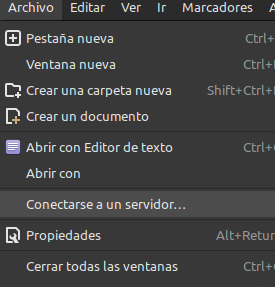
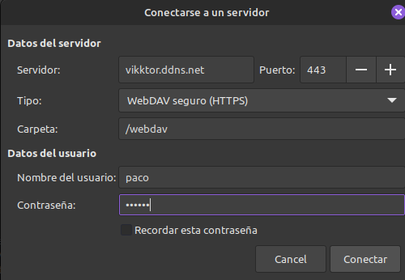
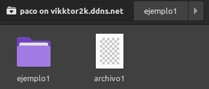
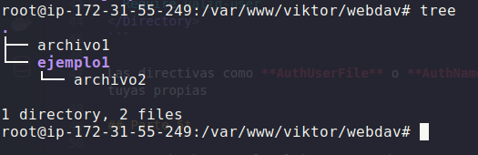

# Reto3

*Victor Martinez Martinez*

WEBDAV (con SSL)
----------------

## Paso 1

**Crearemos un directorio para guardar todos los documentos. En mi caso la ruta sera la siguiente:**

```bash
mkdir /var/www/viktor/webdav
```

## Parte 2

**A continuacion le damos los permisos necesarios para que apache pueda manejar la carpeta:**

```bash
chown www-data:www-data -R /var/www/viktor/webdav
```

## Parte 3

**Ahora tendremos que activar los modulos siguientes para que el WebDav este activo**

```bash
a2enmod dav dav_fs
```

## Parte 4

**Dentro de nuestro archivo de configuracion de la zona, en mi caso 000-default-le-ssl.conf, añadiremos las siguientes lineas**

```bash
DavLockDB /tmp/DavLock
<Directory /var/www/viktor/webdav>
  dav on
  Options Indexes FollowSymLinks MultiViews
  AllowOverride None
  AuthType digest
  AuthUserFile "/etc/claves/digest.txt"
  AuthName "Dominio"
  Require valid-user
</Directory>
```

Las directivas como **AuthUserFile** o **AuthName** tendras que cambiarlas y poner las tuyas propias

## Parte 5

Una vez hecho esto lo ultimo que queda es conectarse por medio de nuestro explorador de archivos y comprobar que todo funciona correctamente:



Rellenamos con las caracteristicas del servidor:



Y podemos obrservar que podemos crear archivos y carpetas:



Y si observamos en el servidor vemos que efectivamente se han creado:


