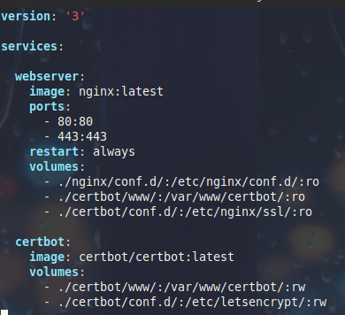
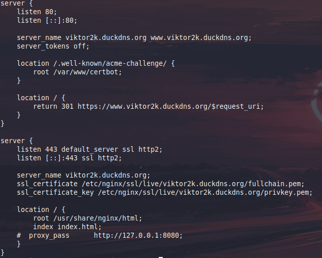

# Reto4
*Victor Martinez Martinez*

Nginx con certificado (En docker)
---

## Paso 1
**Lo primero que hay que hacer es el docker-compose, tendra la siguiente estructura:**  


## Paso 2

**A continuacion crearemos el archivo de configuracion de Nginx en la ruta de directorios nginx/conf.d/default.conf donde su contenido sera este:**


## Paso 3

**Ahora lanzaremos los dockers para que el certbot cree los directorios correspondientes**

```bash
docker-compose up -d
```

## Paso 4

**Y unavez hecho esto ejecutaremos el siguiente comando para generar los certificados:**

```bash
docker-compose run --rm  certbot certonly --webroot --webroot-path /var/www/certbot/ -d viktor2k.duckdns.org
```

---

Cabe recalcar que hay que cambiar el dominio de **viktor2k.duckdns.org** por el que se quiera usar

### Paso extra

Si quisieramos renovar el certificado habria que ejecutar el siguiente comando:

```bash
docker-compose run --rm certbot renew
```