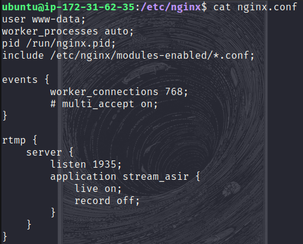
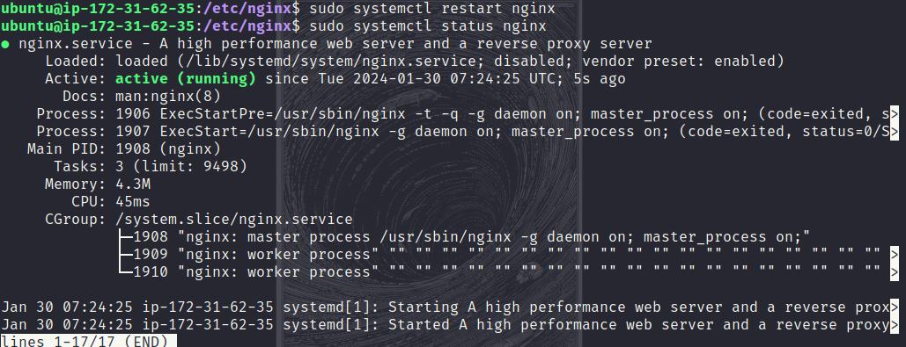
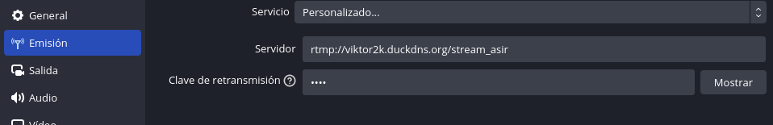
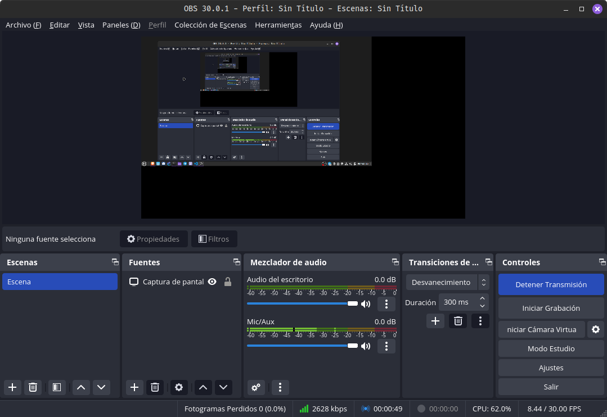
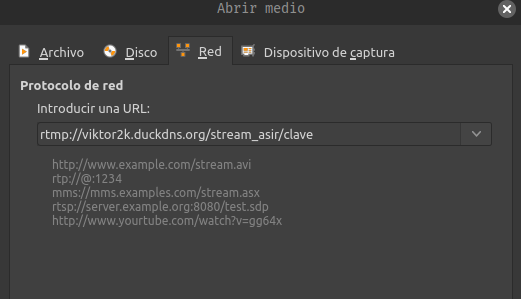
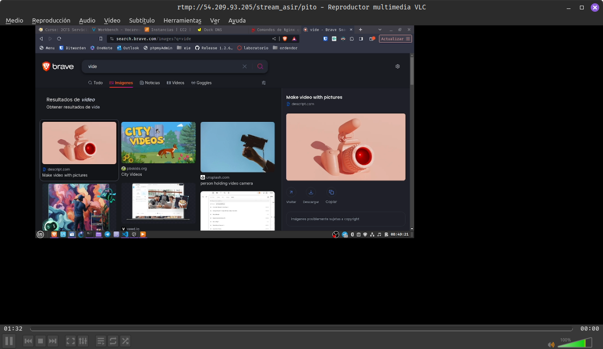

# Reto5

*Victor Martinez Martinez*

Servidor Streaming (Con nginx en EC2)
-------------------------------------

## Paso 1

**Lo primero que haremos sera copiar las siguientes lineas de configuracion dentro del archivo nginx.conf:**

```bash
rtmp {
    server {
        listen 1935;
        application stream_asir {
            live on;
            record off;
        }
    }
}
```



## Paso 2

**Comprobaremos que todo esta bien escrito con el comando:**

```bash
sudo nginx -t
```

La salida sera algo como esto:

```bash
nginx: the configuration file /etc/nginx/nginx.conf syntax is ok
nginx: configuration file /etc/nginx/nginx.conf test is successful
```

## Paso 3

**Si todo esta bien, reiniciaremos el servicio con systemctl:**

```bash
sudo systemctl restart nginx
```

podemos usar tambien **sudo systemctl status nginx** en le caso de que falle para saber que ha pasado


## Paso 4

**Ahora en el obs, hay que indicar el servidor que usaremos para hacer streaming:**
Para ello abriremos el obs -> archivo -> ajustes -> emision -> servicio, indicaremos personalizado.
En el servidor le indicaremos la direccion del servidor junto con el nombre que le hemos indicado en la configuracion del nginx.
Y le pondremos una clave de retransmision que usaremos a la hora de entrar en el directo.
Deberia quedar algo asi:

Una vez hecho esto, aplicamos los cambios, los aceptamos y empezamos a retransmitir, en mi caso yo voy a retransmitir mi pantalla


## Paso 5

**Para comprobar el cliente usaremos el programa vlc**
Para conectarnos al servidor y ver el directo tendremos que ir a medio -> abrir ubicacion de red -> introducir una url, tendremos que poner la del servidor junto con la clave que hemos indicado antes en el obs:


Y podremos observar que la retransmision fuciona:

