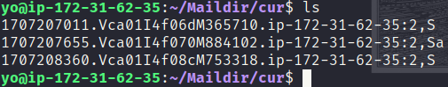
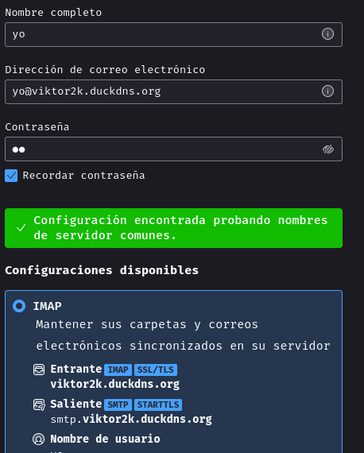
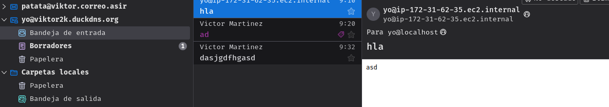

# Reto4
*Victor Martinez Martinez*

Servidor de correo SMTP (Con POP3 y IMAP en EC2)
---

## Paso 1
**El primer paso sera instalar el postfix:**  
```bash
sudo apt install postfix --yes
```

## Paso 2

**Copiaremos el archivo de configuracion de manera que tengamos una copia de seguirad en caso de fallo:**
```bash
sudo cp /usr/share/postfix/main.cf.dist /etc/postfix/main.cf
```
Modificaremos las siguientes lineas:
**Linea 82**
```bash
mail_owner = postfix
```

**Linea 98**
```bash
myhostname = localhost
```

**Linea 106**
```bash
mydomain = viktor2k.duckdns.org
```

**Linea 127**
```bash
myorigin = $mydomain
```

**Linea 141**
```bash
inet_interfaces = all
```

**Linea 180**
```bash
mydestination = $myhostname, localhost.$mydomain, localhost, $mydomain
```

**Linea 232**
```bash
local_recipient_maps = unix:passwd.byname $alias_maps
```

**Linea 277**
```bash
mynetworks_style = subnet
```

**Linea 294: Añade aqui tu red**
```bash
mynetworks = 127.0.0.0/8, 172.31.48.0/20
```

**Linea 416**
```bash
alias_maps = hash:/etc/aliases
```

**Linea 427**
```bash
alias_database = hash:/etc/aliases
```

**Linea 449**
```bash
home_mailbox = Maildir/
```

**Comentamos la primera inea 586**
```bash
#smtpd_banner = $myhostname ESMTP $mail_name (Debian/GNU)
smtpd_banner = $myhostname ESMTP
```

**Linea 659**
```bash
sendmail_path = /usr/sbin/postfix
```

**Linea 664**
```bash
newaliases_path = /usr/bin/newaliases
```

**Linea 669**
```bash
mailq_path = /usr/bin/mailq
```

**Linea 675**
```bash
setgid_group = postdrop
```

**Comenta la linea 679**
```bash
#html_directory =
```

**Comenta la linea 683**
```bash
#manpage_directory =
```

**Comenta la linea 688**
```bash
#sample_directory =
```

**Comenta la linea 692**
```bash
#readme_directory =
```

**Linea 693**
```bash
inet_protocols = ipv4
```

**Añade al final del archivo las siguientes lineas**
```bash
disable_vrfy_command = yes
smtpd_helo_required = yes
message_size_limit = 10240000
smtpd_sasl_type = dovecot
smtpd_sasl_path = private/auth
smtpd_sasl_auth_enable = yes
smtpd_sasl_security_options = noanonymous
smtpd_sasl_local_domain = $myhostname
smtpd_recipient_restrictions = permit_mynetworks, permit_auth_destination, permit_sasl_authenticated, reject

smtpd_client_restrictions = permit_mynetworks, reject_unknown_client_hostname, permit
smtpd_sender_restrictions = permit_mynetworks, reject_unknown_sender_domain, reject_non_fqdn_sender
smtpd_helo_restrictions = permit_mynetworks, reject_unknown_hostname, reject_non_fqdn_hostname, reject_invalid_hostname, permit
```

**Ejectuamos newaliases y reiniciamos el servicio**
```bash
sudo newaliases
sudo systemctl restart postfix
```

## Paso 3

**Ahora pasamos al dovecot:**

```bash
sudo apt install dovecot-core dovecot-pop3d dovecot-imapd --yes
```
En el archivo **/etc/dovecot/dovecot.conf** descomentaremos la linea 30:
```bash
listen = *,::
```

En el archivo **/etc/dovecot/conf.d/10-auth.conf** cambiaremos la linea 10 y 100:
```bash
disable_plaintext_auth = no
auth_mechanisms = plain login
```

En el archivo **/etc/dovecot/conf.d/10-mail.conf** cambiaremos la linea 30:
```bash
mail_location = maildir:~/Maildir
```

En el archivo **/etc/dovecot/conf.d/10-master.conf** cambiaremos la configuracion de la linea 107 a la 109:
```bash
# Postfix smtp-auth
unix_listener /var/spool/postfix/private/auth {
  mode = 0666
  user = postfix
  group = postfix
}
```
Y reiniciaremos el servicio de **dovecot**
```bash
sudo systemctl restart dovecot
```

## Paso 4

**Ahora toca instalar el cliente del mail**

```bash
sudo apt install mailutils --yes
```

Indicamos donde se creara la carpeta de **Maildir**

```bash
su root
echo 'export MAIL=$HOME/Maildir/' > /etc/profile.d/mail.sh
```
Y añadiremos un usuario:
```bash
adduser yo
```

Ahora iniciaremos sesion con el usuario recien creado y nos enviaremos un correo a nosotros mismos para comprobar que el postfix y el dovecot funcionan:

```bash
su yo
mail yo@localhost
Cc:
# Le indicamos un titulo
Subject: Test
# Un texto de ejemplo
Correo de ejemplo.
# Con Ctrl + D se envia el correo
```
Y nos iremos al home de usuario, maildir/cur podremos observar los correos que nos han llegado:



# Paso 4

Para ver los correos desde el thunder bird, lo primero sera instalar el paquete:
```bash
sudo apt install thunderbird
```
Cuando lo abramos y añadamos las credenciales y le demos a continuar nos saldra algo como esto:



Y cuando entremos podremos ver los correos que hemos recibido:



## Paso 5

Para Configurar el servicio con TLS añadiremos al archivo **/etc/postfix/main.cf** las siguientes lineas:

```bash
smtpd_use_tls = yes
smtp_tls_mandatory_protocols = !SSLv2, !SSLv3
smtpd_tls_mandatory_protocols = !SSLv2, !SSLv3
smtpd_tls_cert_file = /etc/letsencrypt/live/viktor2k.duckdns.org/fullchain.pem
smtpd_tls_key_file = /etc/letsencrypt/live/viktor2k.duckdns.org/privkey.pem
smtpd_tls_session_cache_database = btree:${data_directory}/smtpd_scache
```

En el archivo **/etc/postfix/mnaster.cf** descomentaremos lo siguiente:
```bash
submission inet n       -       y       -       -       smtpd
  -o syslog_name=postfix/submission
#  -o smtpd_tls_security_level=encrypt
  -o smtpd_sasl_auth_enable=yes
```
 
Y añadiremos al final del archivo lo siguiente:
```bash
smtps     inet  n       -       y       -       -       smtpd
  -o syslog_name=postfix/smtps
  -o smtpd_tls_wrappermode=yes
  -o smtpd_sasl_auth_enable=yes
```

Y por ultimo en el archivo de dovecot  **/etc/dovecot/conf.d/10-ssl.conf** cambiaremos los siguiente:
```bash
# La linea 6:
ssl = yes
# La linea 12 y 13:
ssl_cert = </etc/letsencrypt/live/viktor2k.duckdns.org/fullchain.pem
ssl_key = </etc/letsencrypt/live/viktor2k.duckdns.org/privkey.pem
```

Y reiniciaremos los servicios:
```bash
sudo systemctl restart postfix dovecot 
```

Ahora volvemos a entrar e iniciar sesion con thunderbird y nos inidicara de manera automatica que se conectara con TLS al servidor