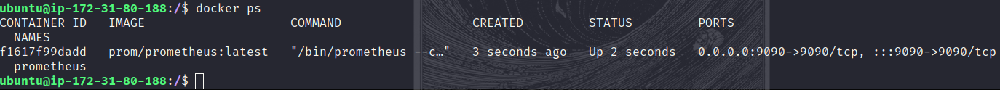
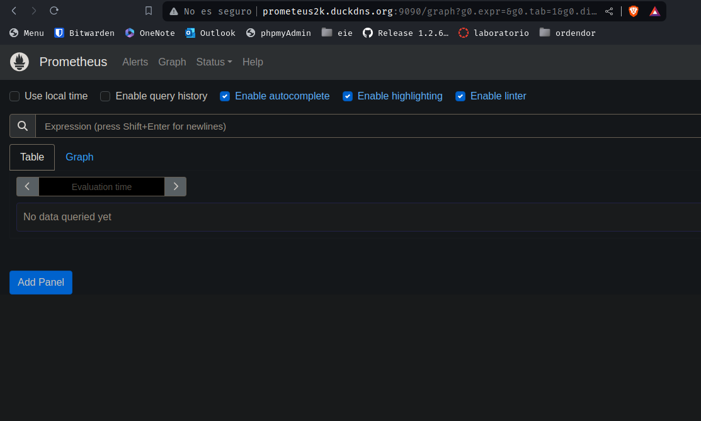
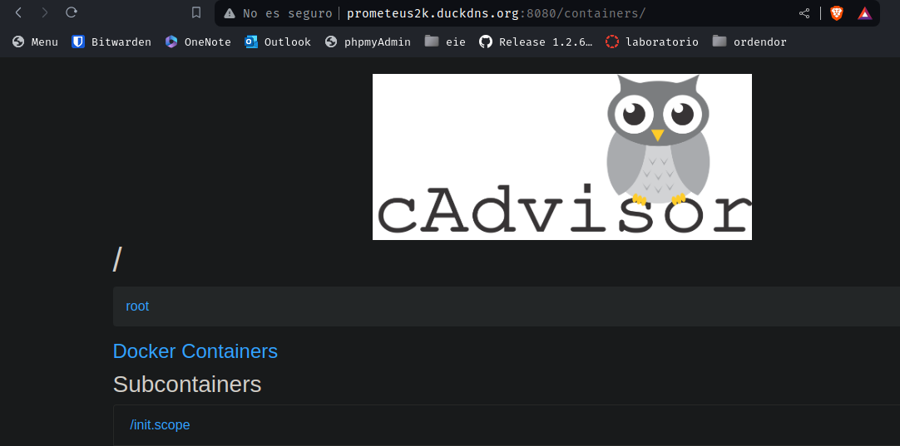
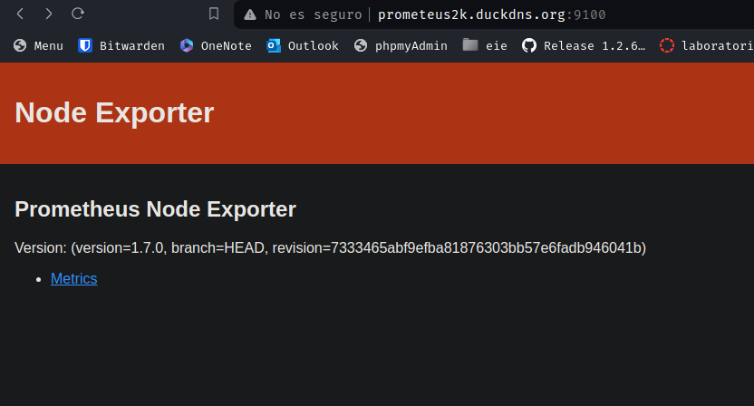
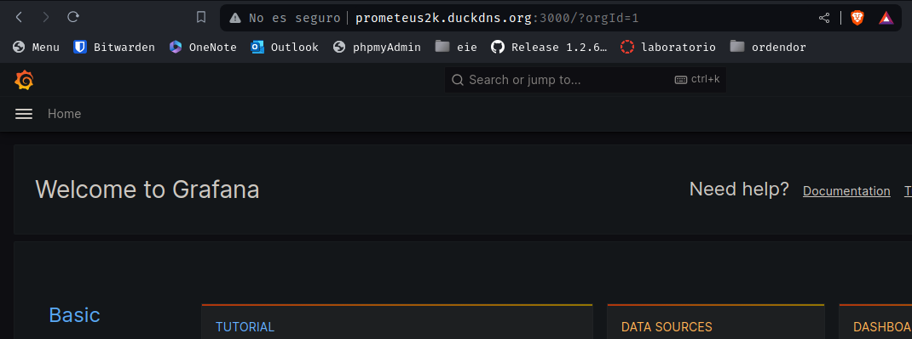
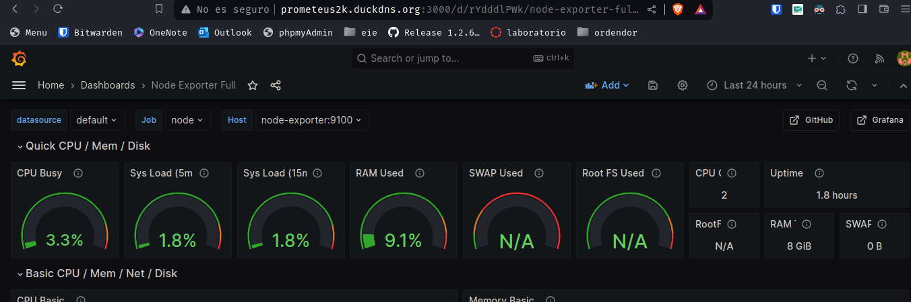

# Reto7

*Victor Martinez Martinez*

Servidor de Monitorizacion (Con Prometeus y Grafana)
----------------------------------------------------

## Paso 1

En Docker, creamos una red donde meteremos todos los contenedores de monitorizacion, para ello:

```
docker network create red-monitoreo
```

Ahora, nos descargamos la imagen de prometheus:

```
docker pull prom/prometheus:latest
```

Y ejecutamos el siguiente docker run para iniciar el contenedor:

```
docker run -d --name=prometheus --network=red-monitoreo -p 9090:9090 -v=/prometheus-data:/prometheus-data prom/prometheus:latest --config.file=/prometheus-data/prometheus.yml
```

Ahora si hacemos un docker ps podemos observar que esta iniciado:



Y si entramos en la web podemos ver que si entramos a la pagina de prometheus:



## Paso 2

Ahora crearemos un docker de cAdvisor, primero haremos el docker pull:

```
docker pull gcr.io/cadvisor/cadvisor:latest
```

Y el docker run es el sigiuente:

```
docker run --name=cadvisor --network=red-monitoreo --volume=/:/rootfs:ro --volume=/var/run:/var/run:rw --volume=/sys:/sys:ro --volume=/var/lib/docker/:/var/lib/docker:ro --publish=8080:8080 --detach=true gcr.io/cadvisor/cadvisor:latest
```


## Paso 3

A continuacion crearemos el docker de los nodos, con este directamente haremos el docker run:

```
docker run -d --name=node-exporter --network=red-monitoreo -p 9100:9100 prom/node-exporter:latest
```

Si lo buscamos veremos lo siguiente:



## Paso 4

A continuacion crearemos el docker de grafana, con este directamente haremos el docker run:

Y el docker run es el sigiuente:

```
docker run -d --name=grafana -p 3000:3000 --network=red-monitoreo grafana/grafana:latest
```
Despues de logarnos como admin y contraseña admin 
Nos pedira que cambiemos la contraseña por seguridad

Y si lo buscamos nos saldra lo siguiente:



## Paso 5

Ahora para añadir docker para monitorizarlos, clicamos sobre add your first data source -> clicamos en el contenedor que queremos y le indicamos su url.

Despues tendremos que crear un dashboard para ver todos los valores -> import dashboard y la id le pondremos 1860, le pulsaremos a load, indicamos el contenedor que queremos ver y listo.

Nos aparecera algo parecido a esto:



Ahora si quisieramos añadir mas lo unico que hay que hacer es repetir el ultimo paso.
